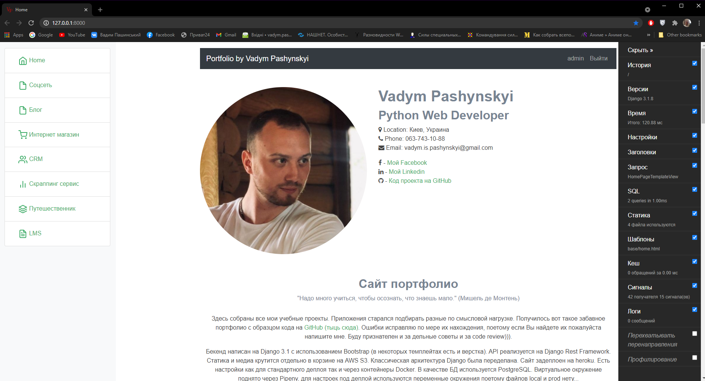
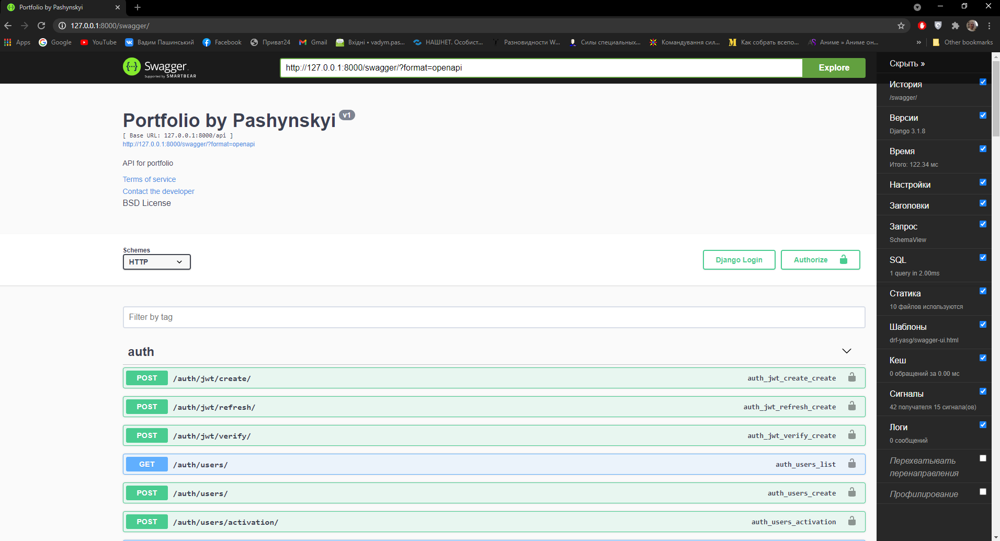

## Table of Contents

* [Features](#features)
* **[Installation](#installation)**
  * [Pipenv](#pipenv)
  * [Docker](#docker)
* [Description](#description)
* [Links](#links)
* [ToDo](#todo)

----

## Features

- Django 3.1 & Python 3.8 & Django REST framework 3.12 & PostgreSQL
- Install via Pipenv, or Docker
- User log in/out, sign up, password reset via self custom authentication (for API djoser, simpleJWT)
- Static files configured with AWS_S3 bucket
- Styling with Bootstrap v4
- Debugging with django-debug-toolbar
- DRY forms with django-crispy-forms
- Documenting API by swagger UI (drf-yasg)
- Deploy on Heroku






----

## Installation

To start, clone the repo to your local computer and change into the proper directory.

```
$ git clone https://github.com/Vadym-Hub/django_portfolio.git
$ cd django_portfolio
```

In the root of the project create file .env and add environment variables.

```
# .env  -  name of txt-file

# Django переменные.
DJANGO_SECRET_KEY=39hy++ll3gs6!bw!=(@*seh#f5#jiknva=y1^1rvm7c7pgh(pz
DJANGO_DEBUG=True

# PostgreSQL Data Base.
POSTGRES_ENGINE=django.db.backends.postgresql
POSTGRES_DB=postgres
POSTGRES_USER=postgres
POSTGRES_PASSWORD=postgres
POSTGRES_HOST=db
POSTGRES_PORT=5432

# Email
EMAIL_BACKEND=django.core.mail.backends.smtp.EmailBackend
DEFAULT_FROM_EMAIL=your@your.com
EMAIL_USE_TLS=True
EMAIL_HOST=your_smtp
EMAIL_PORT=587
EMAIL_HOST_USER=your@your.com
EMAIL_HOST_PASSWORD=your_email_password

# If you want to use AWS_S3 storages for static.
USE_AWS_S3=True
AWS_ACCESS_KEY_ID=your_access_key_id
AWS_SECRET_ACCESS_KEY=your_secret_access_key
AWS_STORAGE_BUCKET_NAME=your_storage_bucket_name
```

### Pipenv

```
$ pip install pipenv
$ pipenv shell
(django_portfolio) $ pipenv install
(django_portfolio) $ python manage.py migrate
(django_portfolio) $ python manage.py createsuperuser
(django_portfolio) $ python manage.py runserver
# Load the homepage of site at http://127.0.0.1:8000
# Load swagger at http://127.0.0.1:8000/swagger
```

### Docker

```
$ docker build .
$ docker-compose up -d
$ docker-compose exec web python manage.py migrate
$ docker-compose exec web python manage.py createsuperuser
# Load the homepage of site at http://localhost:8000
# Load swagger at http://localhost:8000/swagger
```

----

## Description

Description, structure of folder, issues and feature requests! 
See [DESCRIPTION.md](https://github.com/Vadym-Hub/django_portfolio/blob/master/DESCRIPTION.md).

----

## Links

- [Facebook](https://www.facebook.com/profile.php?id=100014867027947)
- [Linkedin](https://www.linkedin.com/in/vadym-pashynskyi-a989bb1b2/)
- [Deploy on Heroku](https://pashynskyi.herokuapp.com)

----

## ToDo

- 

----
